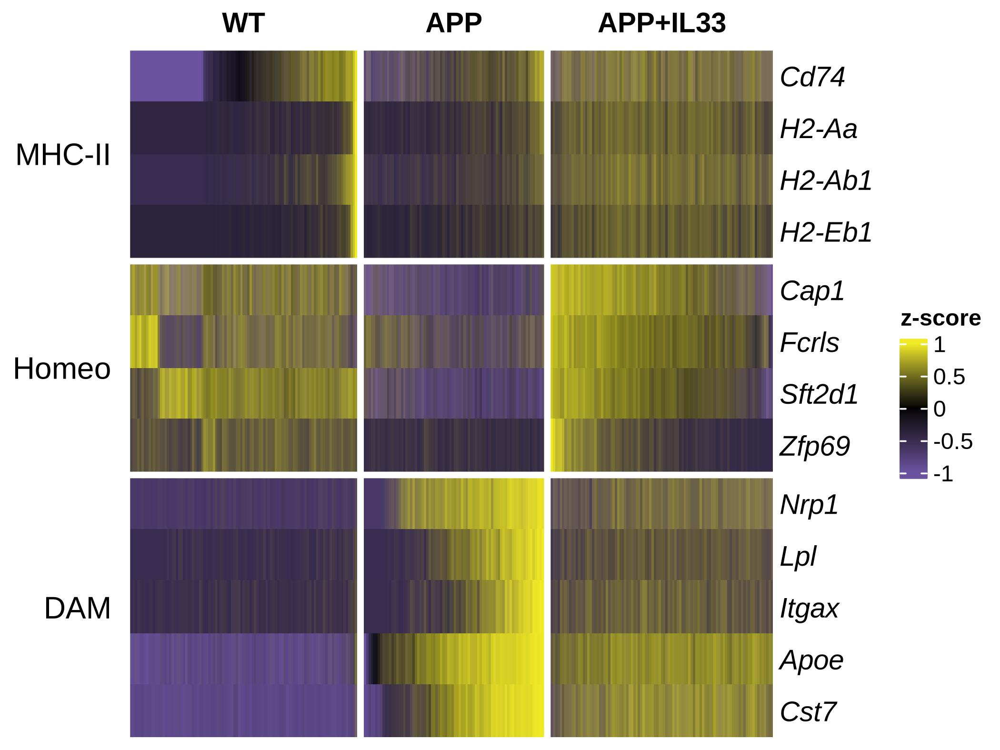

# scHeatmap

[](README.md)
[](README.zh-CN.md)

`scHeatmap` is an R package for creating publication-ready single-cell
heatmaps directly from Seurat objects. It provides a concise interface to
`ComplexHeatmap` while keeping feature order, marker groups, metadata groups,
and within-group cell ordering explicit and reproducible.



*A literature-style microglia heatmap reproduced from data associated with Lau
et al. (2020), [“IL-33-PU.1 Transcriptome Reprogramming Drives Functional State
Transition and Clearance Activity of Microglia in Alzheimer’s Disease”](https://www.cell.com/cell-reports/fulltext/S2211-1247(20)30430-7).
The complete code is shown in [Literature reproduction](#literature-reproduction).*

## Features

- Read expression from Seurat v5 assays and layers.
- Draw cell-level or aggregated average-expression heatmaps.
- Split columns using any Seurat metadata field.
- Balance large groups with reproducible per-group downsampling.
- Arrange genes into ordered marker groups.
- Order cells by metadata, pseudotime, custom scores, clustering, or marker sets.
- Add multiple categorical or continuous metadata annotations.
- Apply per-gene z-score scaling, clipping, and custom color schemes.
- Return a standard `ComplexHeatmap` object for further customization.
- Export consistent PDF and PNG figures.

## Requirements

- R >= 4.1
- SeuratObject
- ComplexHeatmap
- circlize

Seurat is recommended for creating and preprocessing input objects.

## Installation

### From GitHub

Once this repository has been pushed to GitHub, install the development version
with:

```r
if (!requireNamespace("remotes", quietly = TRUE)) {
  install.packages("remotes")
}

remotes::install_github("Landau1994/scHeatmap")
```

Because the example RDS file is stored with Git LFS, install Git LFS before
cloning the full repository:

```bash
git lfs install
git clone https://github.com/Landau1994/scHeatmap.git
```

Installing with `remotes::install_github()` does not require cloning the example
data manually.

### From a local clone

```r
if (!requireNamespace("devtools", quietly = TRUE)) {
  install.packages("devtools")
}

devtools::install("path/to/scHeatmap")
```

## Quick start

The following reproducible example uses the PBMC3K object distributed through
SeuratData. Install it once with `SeuratData::InstallData("pbmc3k")` if needed.
The complete workflow for discovering markers with `FindAllMarkers()` is kept
in [`development/demo.R`](development/demo.R).

```r
library(scHeatmap)

data("pbmc3k.final", package = "pbmc3k.SeuratData")
pbmc <- Seurat::UpdateSeuratObject(pbmc3k.final)
pbmc$cell_type <- factor(
  Seurat::Idents(pbmc),
  levels = levels(Seurat::Idents(pbmc))
)

marker_groups <- list(
  `T cells` = c("IL7R", "CCR7", "LTB", "CD3D", "CD8A", "S100A4"),
  `B cells` = c("MS4A1", "CD79A", "CD37", "CD79B"),
  Monocytes = c("CD14", "LYZ", "FCGR3A", "MS4A7", "CTSS"),
  NK = c("GNLY", "NKG7"),
  Dendritic = c("FCER1A", "CST3"),
  Platelets = c("GP9", "PF4")
)
markers <- unlist(marker_groups, use.names = FALSE)
label_genes <- c("IL7R", "CD8A", "MS4A1", "CD14", "FCGR3A", "GNLY", "FCER1A", "PF4")

ht <- sc_heatmap(
  pbmc,
  features = markers,
  label.features = label_genes,
  split.by = "cell_type",
  feature.groups = marker_groups,
  downsample = 30,
  seed = 2026,
  annotations = "cell_type",
  colors = sc_heatmap_palette("rdbu"),
  show.group.names = FALSE
)

ComplexHeatmap::draw(ht, merge_legend = TRUE)
save_sc_heatmap(ht, "pbmc3k_heatmap", width = 7, height = 5,
                merge_legend = TRUE)
```

For a compact group-level view, aggregate cells by one or more metadata fields:

```r
average_ht <- sc_heatmap(
  pbmc,
  features = markers,
  mode = "average",
  split.by = "cell_type",
  aggregate.by = "cell_type",
  feature.groups = marker_groups,
  annotations = "cell_type",
  show.column.names = TRUE
)
```

`order.by` supports metadata such as pseudotime, marker feature sets, custom
numeric scores, and `"cluster"`. The original slice-specific marker ordering is
still available through `sort.by`.

`label.features` keeps every feature in the expression matrix but displays only
selected genes with connecting lines to their heatmap rows. When `cell_type` is included in `annotations`,
its default colors use the original `divergentcolor` palette; supply
`annotation.colors` to override them.

Linked gene labels are italic by default. Use `label.fontface = "plain"` for
upright text, or `label.gp = grid::gpar(fontface = "plain", col = "red")` for
full style control.

Display controls are independent: `show.feature.names` hides gene labels,
`show.column.names` hides cell/aggregate column names, `show.group.names` hides
split titles, and `show.group.annotation` hides the top metadata annotation.
Every heatmap slice has a black border by default. Use `border.color = FALSE`
to remove borders or provide another color to customize them.

By default, expression is read from the active assay's `data` layer, z-scored
per gene, and clipped to `[-2, 2]`. In `mode = "average"`, the arithmetic mean
is first calculated for each gene across cells in every `aggregate.by` group;
the same scaling and clipping are then applied to the group-level matrix. Use
`scale = "none", clip = NULL` to inspect the unscaled group means.

See the [usage gallery](inst/examples/scHeatmap-gallery.md) for five complete
patterns.

See `?sc_heatmap` and `?save_sc_heatmap` for all options.

## Literature reproduction

The figure at the top of this README demonstrates the more specialized workflow
that motivated this package: genes are divided into biological programs, while
cells in each treatment slice are ordered using a different marker program.
The reproduction data come from the 2020 Cell Reports study by Lau et al.,
[“IL-33-PU.1 Transcriptome Reprogramming Drives Functional State Transition and
Clearance Activity of Microglia in Alzheimer’s Disease”](https://www.cell.com/cell-reports/fulltext/S2211-1247(20)30430-7)
(Cell Reports 31, 107530; DOI: 10.1016/j.celrep.2020.107530).
After cloning the repository with Git LFS, it can be reproduced from the RDS in
`data-raw/`:

```r
cr_seu <- readRDS("data-raw/CR_2020_scRNAseq_seu_annoted.rds")
group_names <- c(WT = "WT", AD = "APP", IL33 = "APP+IL33")
cr_seu$treatment <- factor(
  unname(group_names[as.character(cr_seu$Group)]),
  levels = c("WT", "APP", "APP+IL33")
)
Seurat::Idents(cr_seu) <- "cell_type"
cr_subset <- subset(cr_seu, cell_type %in% c("Homeo", "DAM"))
SeuratObject::DefaultAssay(cr_subset) <- "RNA"

marker_groups <- list(
  `MHC-II` = c("Cd74", "H2-Aa", "H2-Ab1", "H2-Eb1"),
  Homeo = c("Cap1", "Fcrls", "Sft2d1", "Zfp69"),
  DAM = c("Nrp1", "Lpl", "Itgax", "Apoe", "Cst7")
)

cr_ht <- sc_heatmap(
  cr_subset,
  features = unlist(marker_groups, use.names = FALSE),
  split.by = "treatment",
  feature.groups = marker_groups,
  sort.by = list(
    WT = marker_groups[["MHC-II"]],
    APP = marker_groups$DAM,
    `APP+IL33` = marker_groups$Homeo
  ),
  decreasing = c(WT = FALSE, APP = FALSE, `APP+IL33` = TRUE),
  colors = sc_heatmap_palette("purple_black_yellow"),
  color.breaks = c(-1, 0, 1),
  clip = c(-1, 1),
  row_title_rot = 0,
  border = FALSE,
  row_names_gp = grid::gpar(fontface = "italic")
)

ComplexHeatmap::draw(cr_ht)
```

The corresponding export code and the PBMC3K marker-discovery workflow are in
[`development/demo.R`](development/demo.R).

Calculate device dimensions for a heatmap with fixed body dimensions:

```r
size <- calc_ht_size(ht, unit = "inch")
save_sc_heatmap(ht, "my_heatmap", width = size["width"], height = size["height"])
```

## Built-in palettes

Curated palettes from the original project utilities are available through one
documented interface:

```r
list_sc_heatmap_palettes()

sc_heatmap_palette("purple_black_yellow")
sc_heatmap_palette("coolwarm", n = 20)

ht <- sc_heatmap(
  seu,
  features = markers,
  colors = sc_heatmap_palette("skyblue_black_orange")
)
```

The complete analysis object is stored under `data-raw/` with Git LFS and is
excluded from the installed R package. The original reproducible analysis and
legacy utility definitions are retained under `development/`.

## Development

Run development commands from the repository root. `load_all()` exposes the
current source without installing it, which is the fastest way to iterate:

```r
devtools::load_all(".")
devtools::document()
devtools::test()
devtools::check(document = FALSE, manual = FALSE, cran = FALSE)
```

Run the complete development script from the repository root with:

```bash
conda run -n scptools Rscript development/demo.R
```

The script includes synthetic examples, PBMC3K marker discovery, and the
CR2020 reproduction. The complete run requires Seurat, dplyr, plyr,
`pbmc3k.SeuratData`, and the Git LFS RDS under `data-raw/`. Individual sections
can be run interactively when only part of the example data is available.

To install the current checkout into the R library of the `scptools` conda
environment, rather than merely loading its source, run:

```bash
conda run -n scptools Rscript -e 'devtools::install(".", upgrade = FALSE)'
conda run -n scptools Rscript -e 'library(scHeatmap); packageVersion("scHeatmap")'
```

Here, `upgrade = FALSE` only prevents `devtools` from automatically upgrading
installed dependencies such as Seurat and ComplexHeatmap; it does not prevent
the current local version of `scHeatmap` from being reinstalled. This is
recommended for the conda environment because its dependencies are already
installed and unplanned R-side upgrades can introduce version conflicts. Use
`upgrade = TRUE` only when you intentionally want `devtools` to update
dependencies as part of the installation.

The installed package can then be loaded from any working directory whenever
the `scptools` environment is active. Inspect `.libPaths()` in that environment
if you need to confirm the installation location:

```bash
conda run -n scptools Rscript -e '.libPaths()'
```

## License

MIT License.
